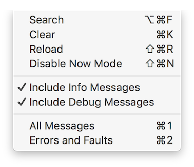

# LogCentral
A modern swift logging utility made for the real needs. 

A customisable and easy to use logging framework that takes care of crash logging, developer console logs and QA logging.

It leverages the new Apple [Unified Logging](https://developer.apple.com/reference/os/1891852-logging) when available in order to do hierarchical console logs (a forgotten revolution!).

Unified logging introduced the concept of **activities** that fits quite well with crash logging needs (some call it breadcrumbs).

The specific logging needs identified are:
- Developer console logs: rich information that helps identify bugs. This is often copious and benefits very much from the activivies/hierarchical logging concept.
- QA logs: The fact that user activities are logged makes it easy to know what happened before the issue is produced. Solves much of the problem of a tester not giving a detailed enough description to reproduce the issue. 
- Crash logs: Services like Crashlytics and Apteligent gathers crash logs, but it is often difficult to identify the reason for the log without knowing what led up to it. These services offers a possiblity of including a limited size log in the crash report.
- Statistics logging: There is a need to log statstical information to services like Mixpanel, Flurry etc. This need is not part of the scope for the moment.

Note that in order to see any logging output you need to open the Console.app and enable info and debug messages 

There are [example categories](LogCentralTests/ExampleCategories.swift) that can be copy pasted
to your own configuration or you can create your own.
